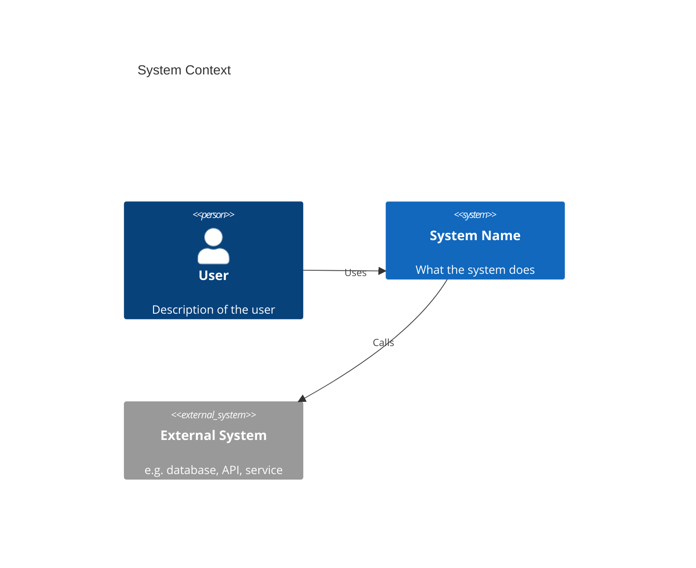
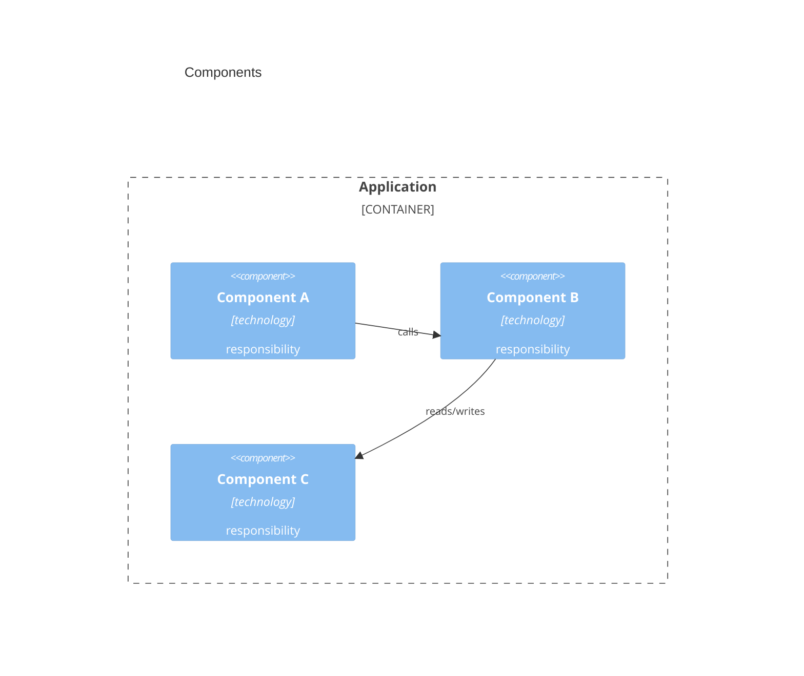
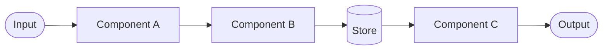
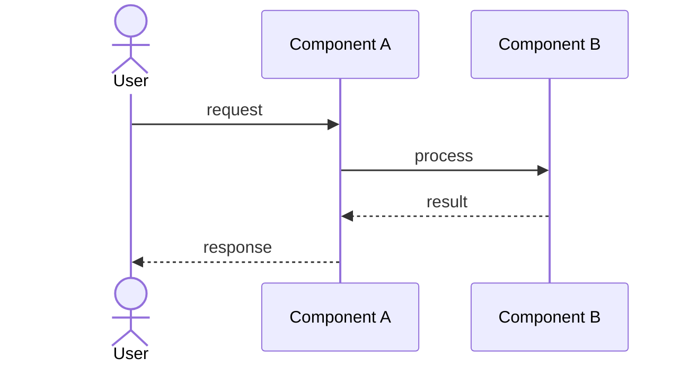

# Architecture

> Living document. Update diagrams when structure changes.

---

## System Context

Who and what interacts with this system.

---

## Components

Key internal modules and their responsibilities.

---

## Data Flows

How data moves through the system.

---

## Sequences

Key interactions over time.

### Happy Path

### Error Case

